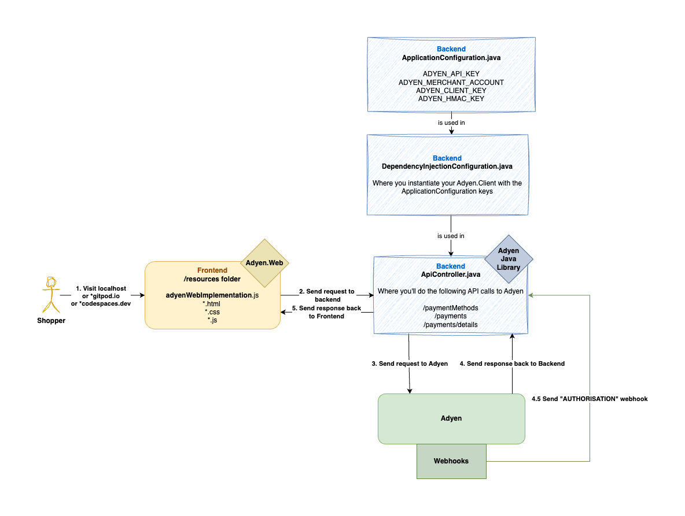
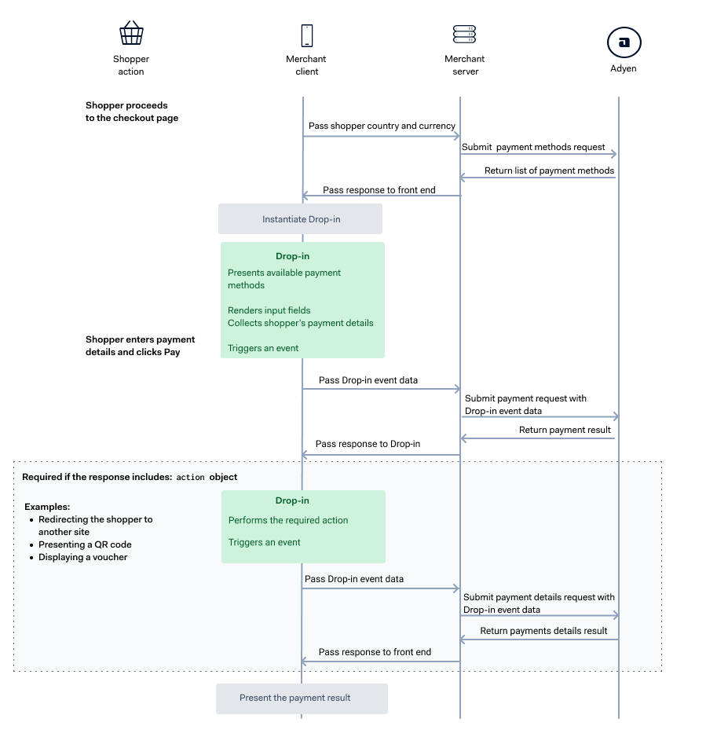

# Build Your Own Payment Integration with Adyen - A Step-by-Step Guide

This repository contains a step-by-step guide to building a payment integration with Adyen.
This README will guide you through the steps to build an Adyen integration and make your first payment on the Adyen TEST environment. We'll cover three main steps:
* The initial configuration & setup: Adyen Merchant Account, Adyen API Credentials, and Adyen Client Key.
* The API requests needed to fetch the payment methods and make your first TEST payment: `/paymentMethods`, `/payments`, `/payments/details`, and 3D Secure 2.
* The webhooks: Setup, configuration, and response handling.
### Prerequisites

You'll need a few things to get started:
* Access to an [Adyen Test Account](https://www.adyen.com/signup).
* You can login to the [Adyen Customer Area on TEST](https://ca-test.adyen.com/) and navigate to your Merchant Account (ECOM).
* An IDE (like IntelliJ or VsCode) and Java SDK v17+, *alternatively,* you can spin up this workspace in a browser-IDE such as codespaces.


### Context of the code repository.

This workshop uses a Java+Spring Boot in the backend with a static (HTML/CSS/Javascript) frontend with a `thymeleaf` template (a server-side Java template engine that can process HTML).

In this workshop, we're not asking you to build a complete integration from scratch but rather to fill in the voids based on resources you can find in the [Adyen Documentation](https://docs.adyen.com)
or other online resources ([GitHub](https://github.com/adyen), [GitHub Examples](https://github.com/adyen-examples), [Adyen Help](https://help.adyen.com) etc.).
We use an empty Spring Boot template at the start, which you'll extend into a fully working application that can accept payments on TEST.

### High-level overview
The focus will be on the frontend (yellow) and the backend (blue) parts of the application.
- Set up keys in [`ApplicationConfiguration.java`](./src/main/java/com/adyen/workshop/configurations/ApplicationConfiguration.java) and use these keys to instantiate the objects we need in [`DependencyInjectionConfiguration.java`](./src/main/java/com/adyen/workshop/configurations/DependencyInjectionConfiguration.java) to securely communicate with Adyen.
- Frontend (yellow): Use the [`Adyen.Web Drop-in`](https://github.com/Adyen/adyen-web) in [`adyenWebImplementation.js`](/src/main/resources/static/adyenWebImplementation.js) to render payment methods, handle authentication and show it to the shopper.
- Backend (blue): Use the [`Adyen Java Library`](https://github.com/Adyen/adyen-java-api-library) in [`ApiController.java`](./src/main/java/com/adyen/workshop/controllers/ApiController.java) to handle incoming requests and securely send them to Adyen.
- Backend (blue): Use the [`Adyen Java Library`](https://github.com/Adyen/adyen-java-api-library) in [`WebController.java`](/src/main/java/com/adyen/workshop/controllers/WebhookController.java) to handle incoming webhooks that Adyen sends.



### Project Structure

The project structure follows a Model-View-Controller (MVC) structure. You can skip this if you're familiar with this.

* The Java code is to be found in `src/main/java/com/adyen/workshop`
  * `/controllers` folder contains your endpoints. The following example creates the `/hello-world` endpoint; see `/controllers/ApiController.java.`

  ```
      @GetMapping("/hello-world")
      public ResponseEntity<String> helloWorld() throws Exception {
          return ResponseEntity.ok().body("This is the 'Hello World' from the workshop - You've successfully finished step 0!");
      }
  ```

  * `/views`-folder contains view controllers that show the HTML pages in the `/resources/static/` folder
  * The code you need to update is in the `/controllers` folder. `ApiController.java`.
  * You can add your environment variables (`ADYEN_API_KEY`, `ADYEN_MERCHANT_ACCOUNT`, `ADYEN_CLIENT_KEY`, and `ADYEN_HMAC_KEY`) in the `application.properties`-file which gets picked up by the `ApplicationConfiguration.java` class.
* The frontend templates are to be found in `src/main/resources/templates` and the static resources in `src/main/resources/static`
  * The code you need to update is in the `src/main/resources/static/adyenWebImplementation.js` and `src/main/resources/templates/layout.html`
* Some additional information:
  * The `clientKey` in `adyenWebImplementation.js` is automatically passed from the backend to the client side and can be accessed using: `clientKey`.

* To run the project, you have two options:
  * `./gradlew bootRun` will start the server on port 8080.
  * To run the project from your IDE, go to `src/main/java/com/adyen/workshop/MainApplication.java` -> Right-click and click `Debug` or `Run`.

## Workshop: Accepting Online Payments using the Advanced flow
Learn how to integrate with Adyen using the `/paymentMethods`, `/payments` and `/payments/details` endpoints.


### Briefing

You're working as a full-stack developer for an ecommerce company that sells headphones and sunglasses in the Netherlands.
They sell the best headphones and sunglasses at 49.99 each, and you're incredibly excited to take on this challenge.
You're not afraid of Java and can code JavaScript; you're ready for this! You've been tasked with implementing credit card, iDeal, and Klarna payments using Adyen.


### Learning goals

In this workshop, you'll learn how to:
1. Set up your Adyen Merchant Account, API Credentials, and Adyen Client Key.
2. Retrieve a list of available payment methods using `/paymentMethods`
3. Make a payment using `/payments` followed by `/payments/details`
4. Handle Strong Customer Authentication using 3DSecure 2.
5. Present the payment results to the user
6. Receive updates on the payments through webhooks


### Start - Step-by-Step Guide:

Open this repository locally or in codespaces:

[](https://github.com/codespaces/new/adyen-examples/adyen-step-by-step-integration-workshop)


**Step 0.** Build the project using `./gradlew bootRun` and see if it works.

If you see the following message in your console logs, it means that you've successfully ran the application. The server will now start listening for incoming requests; Press `Control` + `C` to stop the webserver application.
   - Note: If you see a message with "80% executing...", you're good to go. It means that your webserver is listening for request, and it will keep listening until you force it to stop (see above).
A browser should open with the following screen: **"Workshop: Build Your Own Adyen Payment Integration"**

```
----------------------------------------------------------
	Application is running on http://localhost:8080
----------------------------------------------------------
```

You'll notice that in `MainApplication.java`, we check if you've inserted your keys that are needed to securely communciate with Adyen platform. In the next 3 steps, we'll create these keys and start using them in our application.


**Step 1.** [Create your Adyen Merchant Account](https://docs.adyen.com/account/manage-account-structure/#request-merchant-account) or use an existing Adyen Merchant Account associated with your account (ending with -`ECOM`).

**Step 2.** [Create your Adyen API Key](https://docs.adyen.com/development-resources/api-credentials/#generate-api-key). Ensure you've created the API Key on the Merchant Account level (e.g., you've selected your MerchantAccount `-ECOM` and created credentials in the API Credentials page in the Customer Area).
**And** [generate your Adyen Client Key](https://docs.adyen.com/development-resources/client-side-authentication/#get-your-client-key) on the same page as where you create your API Key.
   - Add the correct URL to the allowed origins (e.g. `http://localhost:8080` if you're working on your localhost, otherwise use the URL of where you deploy your application, e.g. `https://*.github.dev`). This allows the Adyen.Web Dropin/Components to load on your specified page. The `*`-symbol indicates to accept any subdomain.
   - Pro-tip #1: Create your API Key on Merchant Account level & Make sure you **copy your key correctly**.
   - Pro-tip #2: Make 101% sure you copy your key correctly! :)
   - Pro-tip #3: **SAVE YOUR CHANGES**!!
   - Pro-tip #4: Read what the Client Key is used for in the documentation.

**Step 3.** Add the `ADYEN_API_KEY`, `ADYEN_CLIENT_KEY`, and `ADYEN_MERCHANT_ACCOUNT` from steps 1 and 2 to `/main/java/com/adyen/workshop/resources/application.properties`. Pick either options:
   - Option 1: Edit the `application.properties`-file in `/resources/`
```
ADYEN_API_KEY=Aq42_ReplaceWithYourAdyenApiKey
ADYEN_CLIENT_KEY=test_ReplaceWithYourAdyenClientkey
ADYEN_MERCHANT_ACCOUNT=ReplaceWithYourMerchantAccountName
```

   - Option 2 - Best practice: You can `export` the variables in the terminal. The Spring Boot framework automatically injects your variables on startup by matching the attributed string-values in your `/main/java/com/adyen/workshop/configurations/ApplicationConfiguration.java`.
For example: `@Value("${ADYEN_API_KEY:#{null}}")` will check if the `ADYEN_API_KEY` is set, if not, it will default to `null`.
   - Open the terminal and execute the following command in your terminal:
```bash
export ADYEN_API_KEY='Aq42....xx'
export ADYEN_CLIENT_KEY='test_yourclientkey'
export ADYEN_MERCHANT_ACCOUNT='YourMerchantAccountNameECOM'
```

You can now access your keys in your application anywhere:
- `applicationConfiguration.getAdyenApiKey()`
- `applicationConfiguration.getAdyenClientKey()`
- `applicationConfiguration.getAdyenMerchantAccount()`

*Note: Ignore the ADYEN_HMAC_KEY value, we'll create the `HMAC Key` during the webhooks step later on and add this value.*

**Step 4:** Now that we've injected our keys in the application, we're now going to use these keys in our application by instantiating the `Adyen.Client`.

- Navigate to `./src/main/java/com/adyen/workshop/configurations/DependencyInjectionConfiguration.java`. This is where we create our Adyen instances and **re-use** them using Spring's Constructor Dependency Injection (CDI) - A `@Bean` is an object that is instantiated, assembled, and managed by the Spring IoC container. 

- Create the `Adyen.Client` by creating a `new Config()` object in `configurations/DependencyInjectionConfiguration.java`, passing your `ADYEN_API_KEY`, and specifying `Environment.TEST`. This client is now configured to send secure API requests to Adyen. See code snippet below:

```java
// ...

@Configuration
public class DependencyInjectionConfiguration {
    private final ApplicationConfiguration applicationConfiguration;

    public DependencyInjectionConfiguration(ApplicationConfiguration applicationConfiguration) {
        this.applicationConfiguration = applicationConfiguration;
    }

    @Bean
    Client client() {
        // Step 4
        var config = new Config();
        config.setApiKey(applicationConfiguration.getAdyenApiKey()); // We now use the Adyen API Key
        config.setEnvironment(Environment.TEST);		     // Sets the environment to TEST
        return new Client(config);
    }

    @Bean
    PaymentsApi paymentsApi(){
        return new PaymentsApi(client());
    }

    @Bean
    HMACValidator hmacValidator() { return new HMACValidator(); }
}

```


**Step 5.** **You can skip this step**: Install the [Java library](https://github.com/Adyen/adyen-java-api-library) by adding the following line to the `build.gradle` file.
For your convenience, we've **already included this in this project**. 

- Visit the `build.gradle` file and verify whether the following line is included:

```
	implementation 'com.adyen:adyen-java-api-library:31.3.0'
```


**Step 6.** Include the latest [Adyen.Web Dropin/Components](https://docs.adyen.com/online-payments/release-notes/) by adding embed script(`.js`) and stylesheet(`.css`) to `/resources/templates/layout.html`.
  - Including this allows you to access the AdyenCheckout instance in JavaScript.
  - You'll have to find the correct (latest) version of Web Components/Drop-in here.


We're now set up to do the `/paymentMethods`, `/payments` and `/payments/details` calls. In the following steps, we'll have you implement this. Let's have a look at the flow first:



**Step 7.** Send a request to Adyen from (`/controllers/ApiController.java`) to [retrieve a list of available payment methods](https://docs.adyen.com/online-payments/build-your-integration/advanced-flow/?platform=Web&integration=Drop-in&version=5.63.0&programming_language=java#web-advanced-flow-post-payment-methods-request). Go to `ApiController.java` and use the `paymentsApi` to send `/paymentMethods`-request to Adyen.


<details>
<summary>Click here to show me the answer</summary>

```java
    // Step 7
    @PostMapping("/api/paymentMethods")
    public ResponseEntity<PaymentMethodsResponse> paymentMethods() throws IOException, ApiException {
        var paymentMethodsRequest = new PaymentMethodsRequest();
        paymentMethodsRequest.setMerchantAccount(applicationConfiguration.getAdyenMerchantAccount());

        log.info("Retrieving available Payment Methods from Adyen {}", paymentMethodsRequest);
        var response = paymentsApi.paymentMethods(paymentMethodsRequest);
        log.info("Payment Methods response from Adyen {}", response);
        return ResponseEntity.ok().body(response);
    }
```

</details>

**Note:** You can send a `curl-request` to test this endpoint. However, let's move on to step 8 to see how the Drop-in (frontend) interacts with this `/api/paymentMethods` endpoint.

**Step 8.** In the frontend (`adyenWebImplementation.js`), let's make a request to this `/api/paymentMethods` endpoint and display the payment methods to the shopper.

We automatically pass on your public `ADYEN_CLIENT_KEY` to your frontend (see `checkout.html`), you can access this variable using `clientKey`. If you want to find it, here it is:
```
   <div id="clientKey" class="hidden" th:text="${clientKey}"></div>
```


Create the configuration for the `AdyenCheckout`-instance, call the `/api/paymentMethods/`-endpoint, create the `AdyenCheckOut()`-instance, and mount it to `"payment"-div` container (see `/resources/templates/checkout.html`).

To send a request we use the `fetch().then(response => response.json())`, this will send your requests to your backend.
Let's start by copy and pasting the following code below in `adyenWebImplementation.js` to fetch the payment-methods from `/api/paymentMethods`.
We then pass the data to the `AdyenCheckout` class to show it to the shopper. You can read more about how it works in our [documentation](https://docs.adyen.com/marketplaces/checkout-components/?platform=Web&integration=Components&version=6.0.3) in the documentation.


```js
const clientKey = document.getElementById("clientKey").innerHTML;
const { AdyenCheckout, Dropin } = window.AdyenWeb;

// Starts the (Adyen.Web) AdyenCheckout with your specified configuration by calling the `/paymentMethods` endpoint.
async function startCheckout() {
    try {
        // Step 8 - Retrieve the available payment methods
        const paymentMethodsResponse = await fetch("/api/paymentMethods", {
            method: "POST",
            headers: {
                "Content-Type": "application/json",
            }
        }).then(response => response.json());

        const configuration = {
            paymentMethodsResponse: paymentMethodsResponse,
            clientKey,
            locale: "en_US",
            countryCode: 'NL',
            environment: "test",
            showPayButton: true,
            translations: {
                'en-US': {
                    'creditCard.securityCode.label': 'CVV/CVC'
                }
            }
        };

        const paymentMethodsConfiguration = {
            card: {
                showBrandIcon: true,
                hasHolderName: true,
                holderNameRequired: true,
                name: "Credit or debit card",
                amount: {
                    value: 9998,
                    currency: "EUR",
                },
                placeholders: {
                    cardNumber: '1234 5678 9012 3456',
                    expiryDate: 'MM/YY',
                    securityCodeThreeDigits: '123',
                    securityCodeFourDigits: '1234',
                    holderName: 'Developer Relations Team'
                }
            }
        };

        // Start the AdyenCheckout and mount the element onto the `payment`-div.
        const adyenCheckout = await AdyenCheckout(configuration);
        const dropin = new Dropin(adyenCheckout, { paymentMethodsConfiguration: paymentMethodsConfiguration }).mount(document.getElementById("payment"));
    } catch (error) {
        console.error(error);
        alert("Error occurred. Look at console for details.");
    }
}

startCheckout();

```


Run your application to see whether the `Adyen Drop-in` is showing a list of payment methods. You'll notice that the Drop-in won't let you click `"Pay"` as we haven't implemented the `/payments` call yet.

Here are some helpful tips if you do not see any payment methods show up on your website (`http://.../checkout?type=dropin`):
* **Empty response:** Have you configured any payment methods in the Customer Area?
* **Invalid origin:** Have you added the correct origin URLs that allow your `Adyen Drop-in` to be loaded by the page?
* **Unauthorized errors:** Have you specified your credentials correctly?

**Step 9.** Let's create the `/payments` request in `/controllers/ApiController.java` ([see also docs](https://docs.adyen.com/online-payments/build-your-integration/advanced-flow/?platform=Web&integration=Drop-in&version=5.63.0&programming_language=java#post-payments-request-web)) on the backend.
We start by defining a new endpoint `/api/payments` to which our frontend will send a request.

<details>
<summary>Click to show me the answer</summary>

```java
    // Step 9 - Implement the /payments call to Adyen.
    @PostMapping("/api/payments")
    public ResponseEntity<PaymentResponse> payments(@RequestBody PaymentRequest body) throws IOException, ApiException {
        var paymentRequest = new PaymentRequest();

        var amount = new Amount()
                .currency("EUR")
                .value(9998L);
        paymentRequest.setAmount(amount);
        paymentRequest.setMerchantAccount(applicationConfiguration.getAdyenMerchantAccount());
        paymentRequest.setChannel(PaymentRequest.ChannelEnum.WEB);

        paymentRequest.setPaymentMethod(body.getPaymentMethod());

        var orderRef = UUID.randomUUID().toString();
        paymentRequest.setReference(orderRef);
        // The returnUrl field basically means: Once done with the payment, where should the application redirect you?
        paymentRequest.setReturnUrl("http://localhost:8080/handleShopperRedirect");

        log.info("PaymentsRequest {}", paymentRequest);
        var response = paymentsApi.payments(paymentRequest);
        log.info("PaymentsResponse {}", response);
        return ResponseEntity.ok().body(response);
    }
```

</details>


**Step 10.** Let's send a request to our backend, by modifying the `adyenWebImplementation.js`-file. We'll have to override the `onSubmit(...)` function to send a request to the `/api/payments` endpoint.
We'll need to handle the [responses](https://docs.adyen.com/development-resources/overview-response-handling/#result-codes) accordingly.

<details>
<summary>Click to show me the answer</summary>

We've added **three things** to the adyenWebImplementation.js:
* the `onSubmit(...)` event handler
* the `onPaymentCompleted(...)`, `onPaymentFailed(...)` and `onError(...)` event handlers
* the `handleOnPaymentCompleted`/`handleOnPaymentFailed` function to handle the response (which is doing a simple redirect based on the response)


```js
// ...
async function startCheckout() {
    try {
        // ...
        const paymentMethodsResponse = await fetch("/api/paymentMethods", {
            method: "POST",
            headers: {
                "Content-Type": "application/json",
            }
        }).then(response => response.json());

        const configuration = {
            paymentMethodsResponse: paymentMethodsResponse,
            clientKey,
            locale: "en_US",
            countryCode: 'NL',
            environment: "test",
            showPayButton: true,
            translations: {
                'en-US': {
                    'creditCard.securityCode.label': 'CVV/CVC'
                }
            },
            // Step 10 - Add the onSubmit handler by telling it what endpoint to call when the pay button is pressed.
            onSubmit: async (state, component, actions) => {
                console.info("onSubmit", state, component, actions);
                try {
                    if (state.isValid) {
                        const { action, order, resultCode } = await fetch("/api/payments", {
                            method: "POST",
                            body: state.data ? JSON.stringify(state.data) : "",
                            headers: {
                                "Content-Type": "application/json",
                            }
                        }).then(response => response.json());

                        if (!resultCode) {
                            console.warn("reject");
                            actions.reject();
                        }

                        actions.resolve({
                            resultCode,
                            action,
                            order
                        });
                    }
                } catch (error) {
                    console.error(error);
                    actions.reject();
                }
            },
            onPaymentCompleted: (result, component) => {
                console.info("onPaymentCompleted", result, component);
                handleOnPaymentCompleted(result, component);
            },
            onPaymentFailed: (result, component) => {
                console.info("onPaymentFailed", result, component);
                handleOnPaymentFailed(result, component);
            },
            onError: (error, component) => {
                console.error("onError", error.name, error.message, error.stack, component);
                window.location.href = "/result/error";
            }
        };

        // Optional configuration for cards
        const paymentMethodsConfiguration = {
            card: {
                showBrandIcon: true,
                hasHolderName: true,
                holderNameRequired: true,
                name: "Credit or debit card",
                amount: {
                    value: 9998,
                    currency: "EUR",
                },
                placeholders: {
                    cardNumber: '1234 5678 9012 3456',
                    expiryDate: 'MM/YY',
                    securityCodeThreeDigits: '123',
                    securityCodeFourDigits: '1234',
                    holderName: 'Developer Relations Team'
                }
            }
        };

        // Start the AdyenCheckout and mount the element onto the `payment`-div.
        const adyenCheckout = await AdyenCheckout(configuration);
        const dropin = new Dropin(adyenCheckout, { paymentMethodsConfiguration: paymentMethodsConfiguration }).mount(document.getElementById("payment"));
    } catch (error) {
        console.error(error);
        alert("Error occurred. Look at console for details.");
    }
}

// Step 10 - Function to handle payment completion redirects
function handleOnPaymentCompleted(response) {
    switch (response.resultCode) {
        case "Authorised":
            window.location.href = "/result/success";
            break;
        case "Pending":
        case "Received":
            window.location.href = "/result/pending";
            break;
        default:
            window.location.href = "/result/error";
            break;
    }
}

// Step 10 - Function to handle payment failure redirects
function handleOnPaymentFailed(response) {
    switch (response.resultCode) {
        case "Cancelled":
        case "Refused":
            window.location.href = "/result/failed";
            break;
        default:
            window.location.href = "/result/error";
            break;
    }
}

startCheckout();
```

</details>


**Step 11.** **Best practices:** The Adyen API supports idempotent requests, allowing you to retry a request multiple times while only performing the action once.
This key helps avoid unwanted duplication in case of failures and retries (e.g., you don't want to charge a shopper twice because they've hit the pay button two times, right?). To learn more about idempotency for payment requests, see [documentation](https://docs.adyen.com/development-resources/api-idempotency/).

<details>
<summary>Click to show me the answer</summary>

You can _optionally_ add the idempotency key to the existing code in the `/controllers/ApiController.java -> '/api/payments/'`-function

```java
    // Step 11 - Optionally, add the idempotency key
    var requestOptions = new RequestOptions();
    requestOptions.setIdempotencyKey(UUID.randomUUID().toString());

    log.info("PaymentsRequest {}", paymentRequest);
    var response = paymentsApi.payments(paymentRequest, requestOptions); // Notice how we're adding this property to our existing code*
    log.info("PaymentsResponse {}", response);
    return ResponseEntity.ok().body(response);
```

</details>

You should now be able to make a payment, visit the [documentation/test-card-page](https://docs.adyen.com/development-resources/testing/test-card-numbers/) and make a payment using one of the test cards. Alternatively, you can download the official [Adyen Test Card Extension](https://chromewebstore.google.com/detail/adyen-test-cards/icllkfleeahmemjgoibajcmeoehkeoag) to prefill your card numbers.


Congratulations! **However**, we're not there yet! This flow will fail when a challenge is presented to the shopper (Strong Customer Authentication). Let's handle this by adding 3D Secure 2 Authentication support.


3D Secure 2 is an authentication protocol (3DS2) that provides an additional layer of verification for card-not-present (CNP) transactions.
New to 3DS2? You can read our [docs](https://docs.adyen.com/online-payments/3d-secure/) or go to this [technical blog post](https://www.adyen.com/knowledge-hub/a-guide-to-integrating-with-adyen-web-for-3d-secure-2-payments) that will guide you through the why & whats.

To trigger 3DS2, we'll need to add several parameters to the `PaymentRequest` in the `/api/payments` endpoint.
Two options are available:
   * [Native](https://docs.adyen.com/online-payments/3d-secure/native-3ds2/web/): The card issuer performs the authentication within your website or mobile app using passive, biometric, and two-factor authentication approaches.
   * [Redirect](https://docs.adyen.com/online-payments/3d-secure/redirect-3ds2/web/): Shoppers are redirected to the card issuer's site to provide additional authentication data, for example, a password or an SMS verification code. The redirection might lead to lower conversion rates due to technical errors during the redirection or shoppers dropping out of the authentication process.

In this workshop, we implement the **Redirect 3DS2 flow** first, in later steps (13 & 14) you can find out how to enable the Native 3DS2 flow.

**Step 12.** Add the following fields to our `/payments`-request to enable 3DS2 Redirect, note that we can get these field from the frontend (`state.data`), which you can find in the arguments of the (backend)-`/payments` function (see variable: `body`)
``` 
   public ResponseEntity<PaymentResponse> payments(@RequestBody PaymentRequest body)`
```
Go back to the `/controller/ApiController`, add the following parameters to your `PaymentRequest` for the redirect flow:
   * Origin
   * ShopperIP
   * ShopperInteraction
   * BrowserInfo
   * BillingAddress (due to risk rules, we recommend including the `BillingAddress`, even though it's optional).

**Note:** In this example, we implement the Redirect 3DS2 flow. You can also opt-in to implement the [Native 3DS2 flow](https://docs.adyen.com/online-payments/3d-secure/native-3ds2/web-drop-in/#make-a-payment), which we've also included (commented-out*) in the answer below.


<details>
<summary>Click to show me the answer</summary>

**Note:** We're **extending** the PaymentRequest by adding additional parameters!

```java
    @PostMapping("/api/payments")
    public ResponseEntity<PaymentResponse> payments(@RequestBody PaymentRequest body) throws IOException, ApiException {
        var paymentRequest = new PaymentRequest();
        
        var amount = new Amount()
                .currency("EUR")
                .value(9998L);
        paymentRequest.setAmount(amount);
        paymentRequest.setMerchantAccount(applicationConfiguration.getAdyenMerchantAccount());
        paymentRequest.setChannel(PaymentRequest.ChannelEnum.WEB);
    
        paymentRequest.setPaymentMethod(body.getPaymentMethod());
    
        var orderRef = UUID.randomUUID().toString();
        paymentRequest.setReference(orderRef);
        // The returnUrl field basically means: Once done with the payment, where should the application redirect you?
        paymentRequest.setReturnUrl("http://localhost:8080/handleShopperRedirect");


        // Step 12 3DS2 Redirect - Add the following additional parameters to your existing payment request for 3DS2 Redirect:
        // Note: Visa requires additional properties to be sent in the request, see documentation for Redirect 3DS2: https://docs.adyen.com/online-payments/3d-secure/redirect-3ds2/web-drop-in/#make-a-payment
        var authenticationData = new AuthenticationData();
        authenticationData.setAttemptAuthentication(AuthenticationData.AttemptAuthenticationEnum.ALWAYS);
        paymentRequest.setAuthenticationData(authenticationData);

        // Change the following lines, if you want to enable the Native 3DS2 flow:
        // Note: Visa requires additional properties to be sent in the request, see documentation for Native 3DS2: https://docs.adyen.com/online-payments/3d-secure/native-3ds2/web-drop-in/#make-a-payment
        //authenticationData.setThreeDSRequestData(new ThreeDSRequestData().nativeThreeDS(ThreeDSRequestData.NativeThreeDSEnum.PREFERRED));
        //paymentRequest.setAuthenticationData(authenticationData);

        paymentRequest.setOrigin("https://localhost:8080");
        paymentRequest.setBrowserInfo(body.getBrowserInfo());
        paymentRequest.setShopperIP("192.168.0.1");
        paymentRequest.setShopperInteraction(PaymentRequest.ShopperInteractionEnum.ECOMMERCE);

        var billingAddress = new BillingAddress();
        billingAddress.setCity("Amsterdam");
        billingAddress.setCountry("NL");
        billingAddress.setPostalCode("1012KK");
        billingAddress.setStreet("Rokin");
        billingAddress.setHouseNumberOrName("49");
        paymentRequest.setBillingAddress(billingAddress);
        
        // Step 11 - Optionally add the idempotency key
        var requestOptions = new RequestOptions();
        requestOptions.setIdempotencyKey(UUID.randomUUID().toString());
    
        log.info("PaymentsRequest {}", paymentRequest);
        var response = paymentsApi.payments(paymentRequest, requestOptions); // add RequestOptions here
        log.info("PaymentsResponse {}", response);
        
        return ResponseEntity.ok().body(response);
    }
```

</details>


**Step 13.** If want to implement Native 3DS2, implement the `/api/payments/details` call in `/controllers/ApiController`.
Otherwise, skip this step and go to **Step 14**.

<details>
<summary>Click to show me the answer</summary>

```java
    // Step 13 - Handle details call (triggered after the Native 3DS2 flow, called from the frontend in step 14)
    @PostMapping("/api/payments/details")
    public ResponseEntity<PaymentDetailsResponse> paymentsDetails(@RequestBody PaymentDetailsRequest detailsRequest) throws IOException, ApiException
    {
        log.info("PaymentDetailsRequest {}", detailsRequest);
        var response = paymentsApi.paymentsDetails(detailsRequest);
        log.info("PaymentDetailsResponse {}", response);
        return ResponseEntity.ok().body(response);
    }
```

</details>

On the frontend, we'll need to override the `onAdditionalDetails(...)` function in `adyenWebImplementation.js` to call `/api/payments/details` to finalize the payment, after the Native 3DS2 authentication.


<details>
<summary>Click to show me the answer</summary>
We've added the `onAdditionalDetails(...)` function in the `configuration` object to resolve correctly.

```js

// ...
async function startCheckout() {
    try {
        // ...
        const paymentMethodsResponse = await fetch("/api/paymentMethods", {
            method: "POST",
            headers: {
                "Content-Type": "application/json",
            }
        }).then(response => response.json());

        const configuration = {
            paymentMethodsResponse: paymentMethodsResponse,
            clientKey,
            locale: "en_US",
            countryCode: 'NL',
            environment: "test",
            showPayButton: true,
            translations: {
                'en-US': {
                    'creditCard.securityCode.label': 'CVV/CVC'
                }
            },
            // Step 10 - Add the onSubmit handler by telling it what endpoint to call when the pay button is pressed.
            onSubmit: async (state, component, actions) => {
                console.info("onSubmit", state, component, actions);
                try {
                    if (state.isValid) {
                        const { action, order, resultCode } = await fetch("/api/payments", {
                            method: "POST",
                            body: state.data ? JSON.stringify(state.data) : "",
                            headers: {
                                "Content-Type": "application/json",
                            }
                        }).then(response => response.json());

                        if (!resultCode) {
                            console.warn("reject");
                            actions.reject();
                        }

                        actions.resolve({
                            resultCode,
                            action,
                            order
                        });
                    }
                } catch (error) {
                    console.error(error);
                    actions.reject();
                }
            },
            onPaymentCompleted: (result, component) => {
                console.info("onPaymentCompleted", result, component);
                handleOnPaymentCompleted(result, component);
            },
            onPaymentFailed: (result, component) => {
                console.info("onPaymentFailed", result, component);
                handleOnPaymentFailed(result, component);
            },
            onError: (error, component) => {
                console.error("onError", error.name, error.message, error.stack, component);
                window.location.href = "/result/error";
            },
            // Step 13 onAdditionalDetails(...) - Use this to finalize the Native 3DS2 authentication.
            onAdditionalDetails: async (state, component, actions) => {
                console.info("onAdditionalDetails", state, component);
                try {
                    const { resultCode } = await fetch("/api/payments/details", {
                        method: "POST",
                        body: state.data ? JSON.stringify(state.data) : "",
                        headers: {
                            "Content-Type": "application/json",
                        }
                    }).then(response => response.json());

                    if (!resultCode) {
                        console.warn("reject");
                        actions.reject();
                    }

                    actions.resolve({ resultCode });
                } catch (error) {
                    console.error(error);
                    actions.reject();
                }
            }
        };

        // Optional configuration for cards
        const paymentMethodsConfiguration = {
            card: {
                showBrandIcon: true,
                hasHolderName: true,
                holderNameRequired: true,
                name: "Credit or debit card",
                amount: {
                    value: 9998,
                    currency: "EUR",
                },
                placeholders: {
                    cardNumber: '1234 5678 9012 3456',
                    expiryDate: 'MM/YY',
                    securityCodeThreeDigits: '123',
                    securityCodeFourDigits: '1234',
                    holderName: 'Developer Relations Team'
                }
            }
        };

        // Start the AdyenCheckout and mount the element onto the `payment`-div.
        const adyenCheckout = await AdyenCheckout(configuration);
        const dropin = new Dropin(adyenCheckout, { paymentMethodsConfiguration: paymentMethodsConfiguration }).mount(document.getElementById("payment"));
    } catch (error) {
        console.error(error);
        alert("Error occurred. Look at console for details.");
    }
}

function handleOnPaymentCompleted(response) {
    switch (response.resultCode) {
        case "Authorised":
            window.location.href = "/result/success";
            break;
        case "Pending":
        case "Received":
            window.location.href = "/result/pending";
            break;
        default:
            window.location.href = "/result/error";
            break;
    }
}

function handleOnPaymentFailed(response) {
    switch (response.resultCode) {
        case "Cancelled":
        case "Refused":
            window.location.href = "/result/failed";
            break;
        default:
            window.location.href = "/result/error";
            break;
    }
}

startCheckout();

```
</details>


**Step 14.** Let's handle 3DS2 in our `/payments/details`-request by passing the `redirectResult` or `payload` in the `/payments/details`-call.
Add the following function the `controllers/ApiController.java` class. Shoppers will be redirected to this new route after they completed their 3DS2 authentication.

```java
// Step 14 - Handle Redirect 3DS2 during payment.
@GetMapping("/handleShopperRedirect")
public RedirectView redirect(@RequestParam(required = false) String payload, @RequestParam(required = false) String redirectResult) throws IOException, ApiException {
    var paymentDetailsRequest = new PaymentDetailsRequest();

    PaymentCompletionDetails paymentCompletionDetails = new PaymentCompletionDetails();

    // Handle redirect result or payload
    if (redirectResult != null && !redirectResult.isEmpty()) {
        // For redirect, you are redirected to an Adyen domain to complete the 3DS2 challenge
        // After completing the 3DS2 challenge, you get the redirect result from Adyen in the returnUrl
        // We then pass on the redirectResult
        paymentCompletionDetails.redirectResult(redirectResult);
    } else if (payload != null && !payload.isEmpty()) {
        paymentCompletionDetails.payload(payload);
    }

    paymentDetailsRequest.setDetails(paymentCompletionDetails);

    var paymentsDetailsResponse = paymentsApi.paymentsDetails(paymentDetailsRequest);
    log.info("PaymentsDetailsResponse {}", paymentsDetailsResponse);

    // Handle response and redirect user accordingly
    var redirectURL = "http://localhost:8080/result/"; // Update your url here by replacing `http://localhost:8080` with where your application is hosted (if needed)
    switch (paymentsDetailsResponse.getResultCode()) {
        case AUTHORISED:
            redirectURL += "success";
            break;
        case PENDING:
        case RECEIVED:
            redirectURL += "pending";
            break;
        case REFUSED:
            redirectURL += "failed";
            break;
        default:
            redirectURL += "error";
            break;
    }
    return new RedirectView(redirectURL + "?reason=" + paymentsDetailsResponse.getResultCode());
}

```


**Step 15.** Let's test this flow by making a payment using a special card number that always trigger 3DS. You can find more test card numbers on [Adyen docs](https://docs.adyen.com/development-resources/testing/test-card-numbers/).

**Note:** You can also download the official [Adyen Test Card Extension](https://chromewebstore.google.com/detail/adyen-test-cards/icllkfleeahmemjgoibajcmeoehkeoag) to prefill your card numbers.


**Step 16.** After a payment happened, a merchant needs to receive payment updates. Adyen needs to securely notify a merchant's backend server with changes to a payment. To do this, you need to configure webhooks in the Customer Area.

You can receive webhooks by enabling webhooks in the Customer Area, followed by creating your `/webhooks`-endpoint in `controllers/WebhookController.java`.
   - [Read the documentation to understand why we need to enable and verify HMAC signatures](https://docs.adyen.com/development-resources/webhooks/verify-hmac-signatures/)
   - Create a standard webhook in your Customer Area. Example URL: `https://xxxx.github.dev/webhooks`
   - Inject your `ADYEN_HMAC_KEY` in your `ApplicationConfiguration.java` by either exporting the `ADYEN_HMAC_KEY` value or adding it to `application.properties`. You can then use this key to verify the incoming HMAC signature from your webhoo

<details>
  <summary>Click to show me the answer</summary>

```java
    @PostMapping("/webhooks")
    public ResponseEntity<String> webhooks(@RequestBody String json) throws Exception {
        log.info("Received: {}", json);
        var notificationRequest = NotificationRequest.fromJson(json);
        var notificationRequestItem = notificationRequest.getNotificationItems().stream().findFirst();

        try {
            NotificationRequestItem item = notificationRequestItem.get();

            // Step 16 - Validate the HMAC signature using the ADYEN_HMAC_KEY
            if (!hmacValidator.validateHMAC(item, this.applicationConfiguration.getAdyenHmacKey())) {
                log.warn("Could not validate HMAC signature for incoming webhook message: {}", item);
                return ResponseEntity.unprocessableEntity().build();
            }

            // Success, log it for now
            log.info("Received webhook with event {}", item.toString());

            return ResponseEntity.accepted().build();
        } catch (SignatureException e) {
            // Handle invalid signature
            return ResponseEntity.unprocessableEntity().build();
        } catch (Exception e) {
            // Handle all other errors
            return ResponseEntity.status(500).build();
        }
    }
```
</details>


**Step 17.** Congratulations, you've successfully built an integration with Adyen! You can now add support for different [payment methods](https://docs.adyen.com/payment-methods/).
You can (optionally) now compare your solution to the solution in the [workshop/solution branch](https://github.com/adyen-examples/adyen-step-by-step-integration-workshop/tree/workshop/solution-v6-dropin).


If you want to go the extra mile, you can try enabling the following payment methods:

**Step 18.** Enable [iDeal](https://docs.adyen.com/payment-methods/ideal/web-drop-in/).
   - Do not forget to enable the payment method in your [Customer Area](https://ca-test.adyen.com/)

**Step 19.** [Enable Klarna](https://docs.adyen.com/payment-methods/klarna/web-drop-in/?tab=_code_payments_code__2), we'll need to add an additional parameter in the payment request.
   - Do not forget to enable the payment method in your [Customer Area](https://ca-test.adyen.com/)
   - Do not forget to add `LineItems` to your payment-request

Well done! You've now set a good understanding of a basic payment flow. We encourage you to explore and understand our [different use-cases (fully-working integration-examples) on github.com/adyen-examples](https://github.com/adyen-examples/).

## Additional content
For additional use cases, you can (optionally) explore the following resources for a "Part 2" of the workshop:
* [Tokenization Module](README_TOKENIZATION.md)
* [Preauthorisation Module](README_PREAUTHORISATION.md)

You can find a fully-working solution on [github.com/adyen-examples](https://github.com/adyen-examples/).

## Contacting us

If you have any questions, contact us at devrel@adyen.com.
